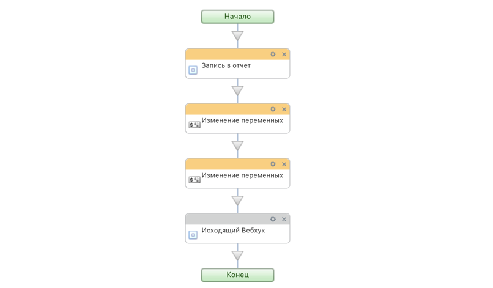
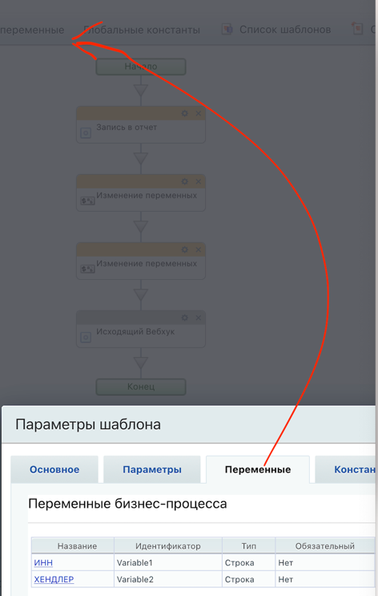
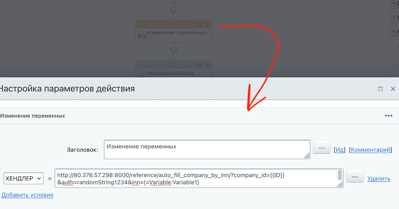
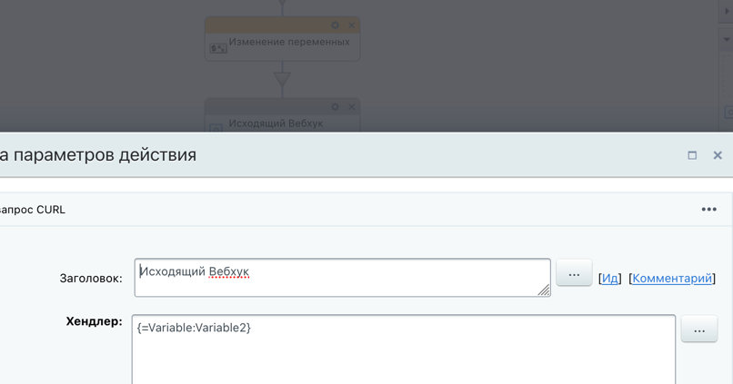

## API для Битрикс24 с вызовом из БП

Есть какой-то БП


**Задача - отправить данные, отправить набор данных, чтобы в fast-api произошла обработка и вызов библиотеки fast-bitrix24, которая из заранее установленных для одного портала параметров ( keys.py ) вызывает методы REST API**

Можно эти CURL использовать для дебага, если стандартного трекера и отладчика не хватает.

Итак, вот, мы... Тьфу, млин. Ближе к делу) Вот какие настройки надо внести.

Сначала устанавливатся переменные



В шаге до вызова Curl эти переменные устанавливаются


И curl должен сработать


Мне невдомек, какой у вас IDE, предположу лайт вариант. В файле main.py вставить
```
if __name__ == "__main__":
    pass
    uvicorn.run(app, host="192.168.1.2", port=8000
                # , ssl=ssl_context
                )
    '''uvicorn.run(
        # app,
        "__main__:app",
        host="192.168.1.2", port=8000,
        reload=True,
        # workers=2,
        ssl_keyfile="./key.pem",
        ssl_certfile="./cert.pem")
    '''
```

Если приложение запустили, то откройте страницу [http://localhost:8000/docs](http://localhost:8000/docs) и тестируйте на здоровье)


Я только ЗА, чтобы происходила не демонизация guicorn/uvicorn, а чтобы приложение запускалось через Supervisor с помошью
start_app.sh
```
#!/bin/bash
#  --worker-class $WORKER_CLASS \

NAME=app_b24-fastapi
DIR=/home/myuser/app_b24
USER=owner
GROUP=owner
WORKERS=3
WORKER_CLASS=uvicorn.workers.UvicornWorker
VENV=$DIR/.venv/bin/activate
BIND=0.0.0.0:8100
LOG_LEVEL=error

cd $DIR
source $VENV

exec gunicorn wsgi:app \
  --name $NAME \
  --workers $WORKERS \
  --user=$USER \
  --group=$GROUP \
  --bind=$BIND \
  --log-level=$LOG_LEVEL \
  --log-file=-

```

Как Вы настроите nginx и какие задачи решаете, не знаю, но вот примерно как может выглядеть файл конфигурации для вашего ресурса
```
        location /app_b24 {
            proxy_pass http://localhost:8100/;
            proxy_read_timeout 300;
            proxy_connect_timeout 300;
            proxy_set_header Host $host;
            #proxy_set_header Host $host:$server_port;
            proxy_set_header X-Real-IP $remote_addr;
        }
        location /swaggeruiapp_b24 {
            proxy_pass  http://127.0.0.1:8100/docs/;
        }

```


Может, это все - лишнее (https) не будете применять, тогда хотя-бы сделайте намек на микросервис, огородив доступ с помошью iptables 